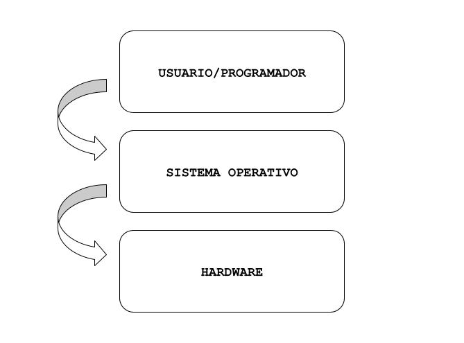

# 1.1 ¿Qué es un sistema operativo?

Un sistema opearativo es el conjunto de programas que administran los recursos de hardware de la computadora y permiten el acceso seguro y fácil del los recursos a las aplicaciones y programas que desarrollan los programadores, para que estos no tengan que preocuparse por el control a bajo nivel de la computadora. 

